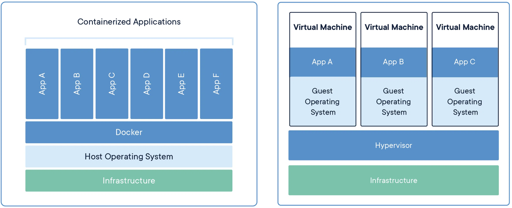

# Introduction

Get from this

to this:

## Why Docker?

(proudly made with the help of ChatGPT)

### 1. Consistency across environments

Docker allows you to package an application and its dependencies into a single unit – a container. This container runs consistently across different environments, ensuring that what works on your development machine also works in production. Say goodbye to the classic "it works on my machine" problem.

Docker's lightweight nature enables swift deployment and scaling. Whether you're deploying a single container or orchestrating a complex microservices architecture, Docker simplifies the process, reducing time-to-market.

### 2. Lightweight and fast

[source](https://www.docker.com/resources/what-container/)

Unlike traditional virtual machines, Docker containers share the host OS's kernel, making them lightweight and quick to start. This efficiency results in faster deployment times and optimal resource utilization.

### 3. Isolation without overhead

Docker provides process isolation, allowing applications to run independently. Each container has its own filesystem, processes, and network, but without the overhead of a full operating system. This balance between isolation and efficiency is a key Docker strength.

### 4. Ecosystem and community support

Docker has a vast ecosystem with a wealth of pre-built images available on Docker Hub. The large and active community means you can find solutions to almost any problem you encounter, making troubleshooting and development more efficient.

## Next step

Head over to [step 1](../step-1/README.md)!
