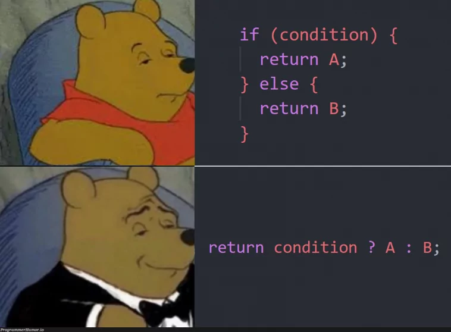

# Step 2

First, change into the directory of `step 2`:

```shell
cd ../step-2
```

## A bit more sophisticated



For this step, we want to dockerize a more useful program - a simple THA todo app. It runs with `Flask` for providing the app endpoints and uses `SQLAlchemy` to persist our todos into an `SQLite` database.
Hence, we need to work with dependencies and figure out, how we can access our container from the outside.

Compared to our previous app, we need to tell Docker to include our dependencies in the image. Otherwise, we won't be able to use the full functionality.
To do this, include the following in the Dockerfile after `FROM ...`:

```Dockerfile
# Copy the requirements file first to leverage Docker caching
COPY requirements.txt .

# Install the dependencies
RUN pip install -r requirements.txt
```

But why bother first copying and installing the dependencies, when the `requirements.txt` gets already copied with `COPY . .`?
Each docker stage can be cached when there are no changes made to gain faster subsequent build times. So, if we only make changes to our own source code (affected by `COPY . .` after the dependency installation) without touching the dependencies, we don't need to rebuild the whole image. Nice!

After `COPY . .` we also want to include

```Dockerfile
# Expose the port the web app runs on
EXPOSE 5000
```

to document on which port our app will be served.

## Beam me up, Scotty!

Build your app with

```shell
docker build -t applied-ai-docker-tutorial:step-2 .
```

and run it with

```shell
docker run --publish 5000:5000 applied-ai-docker-tutorial:step-2
```

Here, we need to specify the port mapping with `--publish <host_port>:<container_port>` (shorthand `-p`). This also gives us the ability to use a different port on the host, e.g. when it is already occupied on the host computer.

## Change is the only constant in life

What, if we want to change our source code? Our todos should stay the same, because they are saved to a database, right?

Try to change something in `app.py` and rebuild with

```shell
docker build -t applied-ai-docker-tutorial:step-2-change .
```

and run it with

```shell
docker run -p 5000:5000 applied-ai-docker-tutorial:step-2-change
```

What can you observe?


## Next step

Head over to [step 3](../step-3/README.md)!
